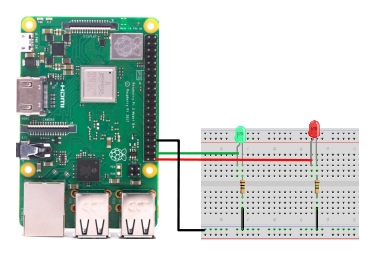

# rpi_led_ctrl
A simple module that combines Naomi and a remote Raspberry Pi platform to show possibilities in IOT and new interactions.  
This Naomi speech handler plugin implements the control of two LEDs attached to the pins of the GPIO connector on a remote network connected Raspberry Pi. Under voice control either or both LEDs can be turned on or off or blinked.
- **Language** English
- **Naomi Version Support** V3.0
- **Dependencies** gRPC, Python wiringpi
## Description
In this plugin Naomi acts as a client collecting vocal input about the colour(s) and operation to be performed on a red and a green LEDs connected to pins of the GPIO port physical connector on a remote network connected Raspberry Pi acting as the server. The inter-platform communicates is handled using Googles open source protocol buffer Internet communications mechanism implemented via the gRPC module. The server on the remote Raspberry Pi makes use of the Python wiringpi module to access the GPIO port and electrically contol the pins the LEDs are connected to.  
**Note** that implementing this plugin is not really for beginners. It requires the careful installation of several software packages on two different hardware platform as well as some configuration setup. The steps in the installation guide below are complete but not overly detailed and assume a level of comfort with both the Linux and Naomi environments.
## Install
Installation is an involved process since there is separate software that must be install on both the client and server. On the client it requires not just installing and enabling the rpi_led_ctrl plugin using Naomi commands but also the gRPC module must be installed. On the server the server-side controller software, the gRPC module, and Python wiringpi module must all be installed along with actual physical wiring of the LEDs and their resistors to the GPIO connector.
### Install Client
1. Copy the directory *led_controller* and its contents into the Naomi/plugins/speechhandler directory 
2. In order for the client to communicate over the network to the server it must know the network IP address and port of the server. Of course this will change from installation to installation so you will have to manually update this in the software. On the client in the  directory *led_controller* edit the file *led_controller.py*. Near the top of the file is the line:
```shell
serverIP = '192.168.50.173:50051'    
```
3. Change the value **192.168.50.173** to the IP address of your server and save the file. 
4. The led_controller plugin is installed in Naomi as follows:
```shell
cd your_Naomi_directory
./Naomi --install "led_contoller"  
...  
./Naomi --enable "led_contoller"  
...  
```
5. Instructions for the installation of the gRPC modules may be found [here](https://grpc.io/docs/languages/python/quickstart/). Install both grpcio and grpcio-tools. This should be done as root using sudo. (**Note**: These installs must be done with python3 and pip3.)
### Install Server
1. Instructions for the installation of the gRPC module may be found above.  
2. Instructions for the installation of the Python wiringpi module may be found [here](https://pypi.org/project/wiringpi/).  
3. Copy the directory *LED_responder* and its contents to an appropriate location in the home directory.
#### Wiring
Ensure you use the right value current limiting resistors for the LED and you observe the correct polarity on the LED pin wiring.
- **Ground Wire** GPIO connectory pin 34
- **Green LED** GPIO connectory pin 38
- **Red LED**   GPIO connectory pin 40

## Operation and Testing
With all the software installed on both client and server, and the hardware setup on the server, go to a terminal session on the led_controller Raspberry Pi and start the Naomi client:
```shell
cd your_Naomi_directory
./Naomi     
```
Then go to a terminal session on the LED_responder Raspberry Pi server and enter:
```shell
cd LED_responder_server_program_directory_
.python3 led_ctlr_server.py 
```
You can now test things out by saying "Naomi set red on". If that works try the green LED.
## Usage
Naomi will accept led controller commands in the following formats:  

**NAOMI {action keyword} {colour keyword}** (optional LED) **{operation keyword}**   
OR   
**NAOMI {action keyword} {operation keyword} {colour keyword}** (optional LED)  
- **{action keyword}** - blink, set, turn (if missing default is turn)
- **{operation keyword}** - on, off (if missing operation defaults to on)
- **{colour keyword}** - green, red (if missing colour the action/operation applies to both)  

Naomi will give an error message if it cannot detect a meaningful combination of keywords.
## Going Further
- **Change GPIO Pins** The default assignment of the green LED on GPIO20, physical connector pin 38, and the red LED on GPIO21, physical pin 40. 
The actual GPIO pins used can easily be changed by modifying the values of **greenGPIOpin** and/or **redGPIOpin**
near the beginning of the file **led_ctlr_server.py** but this will of course change the physical pin assignment on the connector.
- **Add message features to protocol buffer channel** - Features are added to the communication channel as defined  by the gRPC protocol buffer specifications in the led_ctlr.proto file included with the server software. A basic tutorial on the definition and use of this file can be found in the [Quick start](https://grpc.io/docs/languages/python/quickstart/) and [Basic Tutorial](https://grpc.io/docs/languages/python/basics/) for gRPC.  
Since the interprocess communication is not secure one of the first features to add for a "real" application is probably securing the channel. This is discussed in the gRPC documentation.
- **Add new remote control functions** - The above application makes use of the Python port of the wiringpi libraries for interfacing with the server GPIO. These were originally develop for C and unfortunately the original author, after ten years of support, has decided to move on and deprecated the original libraries. This currently effects mostly the accuracy of some of the documentation at [wiringpi site](http://wiringpi.com/). However the good news is that the original project has been forked and is supported by a new community.  
This all being said the wiringpi suite of capabilities is available and supports access to a variety of GPIO function. In particular there are many I2C sensors for tempurature, humidity, air pressure, magnetometer, accelerometer, gyroscopes, etc. that are easily interfaced with a Raspberry Pi using [I2C wiringpi routines](http://wiringpi.com/reference/i2c-library/) and therefore could be made accessible to Naomi. The development of this kind of gRPC and wiringpi functionality is beyond the realm of Naomi user support and developers are directed to the communities supporting these specific foreign packages.
